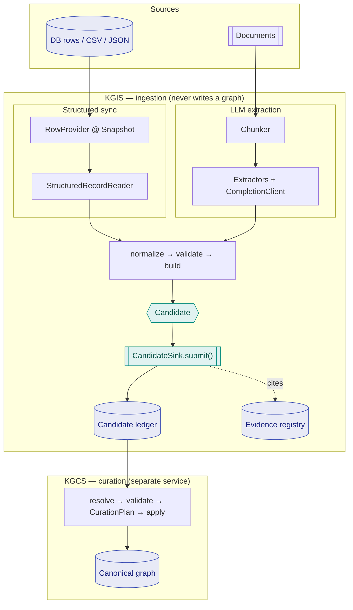

# Architecture

KGIS is a **ports-and-adapters** system. Every stage of ingestion is a small,
injected protocol (a *port*); concrete implementations (*adapters*) are wired
together by a pipeline. That is what lets the same engine ingest a CSV, a SQL
table, or a corpus of documents, and what makes each stage independently
testable.

## The stages as ports

An ingest run is a sequence of ports, each replaceable:

| Port | Responsibility |
|---|---|
| `RecordReader` / `Source` | Read raw records from a source (CSV, JSON, iterable, DB rows, documents). |
| `Normalizer` | Coerce fields to a schema (`SchemaNormalizer`, `FieldSpec`), producing a `NormalizedRecord`. |
| `RecordValidator` | **Record-scoped** validation — is this row usable at all? (Two-tier validation, ADR-0015.) |
| `CandidateBuilder` | Turn a normalized record into one or more `Candidate`s (entity, attribute, relation, …). |
| `CandidateValidator` | **Candidate-scoped** validation — e.g. does it fit the `Ontology`? |
| `CandidateSink` | The single write surface: submit candidates. Everything else is a read. |
| `Clock` / `IdStrategy` | Injected time and IDs — a `FixedClock` + `DeterministicIdStrategy` make a run deterministic. |

`IngestPipeline` sequences them. Determinism is a property of *how you configure
the pipeline*, not of the harness: inject deterministic time and IDs and you get
reproducible output; inject `SystemClock` and `RandomIdStrategy` and you don't.

## The Candidate seam

Everything ingestion produces is a `Candidate` — a proposed assertion submitted
through `CandidateSink`. This is the universal seam between the two halves of the
system:

- **KGIS** (this side) emits proposals. Its only write surface is
  `CandidateSink.submit(candidates)`.
- **KGCS** (the other side) evaluates proposals into canonical facts through a
  separate, executor-only `GraphMutationStore` that application code never sees.

The store contracts are deliberately **two-level** (ADR-0010): the
application-facing `CandidateSink` is *the only surface projects get*, and the
internal `GraphMutationStore` is reachable only by the curation executor. There
is no direct-upsert method on the surface an integrator touches, so the pipeline
cannot be bypassed "because it's convenient."

## Two ingestion paths, one spine

KGIS has two ingestion **modes**, but they are not two architectures. Both feed
the *same* normalize → validate → build → `CandidateSink` spine:

- **Structured sync** — a database-shaped source (`RowProvider` pinned to a
  repeatable-read `Snapshot`) adapted to a `RecordReader`. Deterministic;
  supports cross-run idempotency via the durable ledger. See
  [Structured sync](usage/structured-sync.md).
- **LLM extraction** — documents chunked with stable coordinates, per-entity-type
  extractors run behind an injected `CompletionClient`, output parsed and built
  into candidates by the *same* builders. Non-deterministic against a live model
  (use a replay client for determinism). See
  [LLM extraction](usage/llm-extraction.md).

## Namespaced identity

Every canonical entity has an **immutable internal identity ID** (e.g.
`kg://<graph-id>/identity/01J...`) that never changes, plus **namespaced
external aliases** modeled as `EntityRef{entity_type, namespace, key}` and
rendered `Label:namespace:key` at adapter boundaries only. Bare `Label:key` is
forbidden for cross-project use: it says nothing about the identifier authority,
which is the strongest single signal in entity resolution (ADR-0008). Correcting
a natural key updates the *alias*, never the identity.

## Two confidence axes

Candidates carry `CandidateScores` with two independent axes, never a single
collapsed float:

- **`source_reliability`** — how trustworthy the *source* is (required; no
  default).
- **`extraction_confidence`** — how sure *this extraction* was (defaults to
  `1.0`, legitimate for an exact structured read).

Keeping them separate means an exact CSV read from a mediocre source, and a
low-confidence LLM guess from an authoritative source, are never confused
(ADR-0004 as amended).

## The three stores

KGIS persists what it proposes; it does not persist a graph (ADR-0006):

1. **Candidate ledger** — durable, replayable proposed assertions with source
   coordinates, versions, evidence refs, quality signals, and a processing
   state. Uncertain candidates live *here*, never as graph nodes.
2. **Canonical graph** — accepted identities and assertions. **Owned by KGCS**,
   not KGIS.
3. **Derived projections** — disposable, reproducible artifacts (search indices,
   embeddings, GraphRAG summaries) built only from canonical data at a published
   curation epoch.

The candidate ledger (`SqliteCandidateLedger`) and evidence registry
(`SqliteEvidenceRegistry`) are the two stores KGIS itself provides.

## Guarantees

- **Determinism** via injected `FixedClock` + `DeterministicIdStrategy`.
- **Idempotency** via content-addressed `candidate_id`s and the durable ledger.
- **Evidence integrity** — availability is always PRESENT / ABSENT / ERROR; a
  dangling `EvidenceRef` raises (ADR-0009).
- **Honest nulls** — unmeasured is `None` + reason, never `0.0`.
- **Governed erasure** — ledger revoke and erase are *logical*: erase nulls the
  live payload and keeps a hash tombstone; it is **not** an at-rest / forensic
  scrub (ADR-0013).
- **No graph writes from ingestion** — enforced by the two-level store contracts
  (ADR-0010).

For authoritative depth, see the repository's ADR index
(`llm/governance/adr/README.md`) and the design spec
(`llm/specs/2026-07-09-kgis-kgcs-design.md`). This site links to that source of
truth rather than duplicating it.
